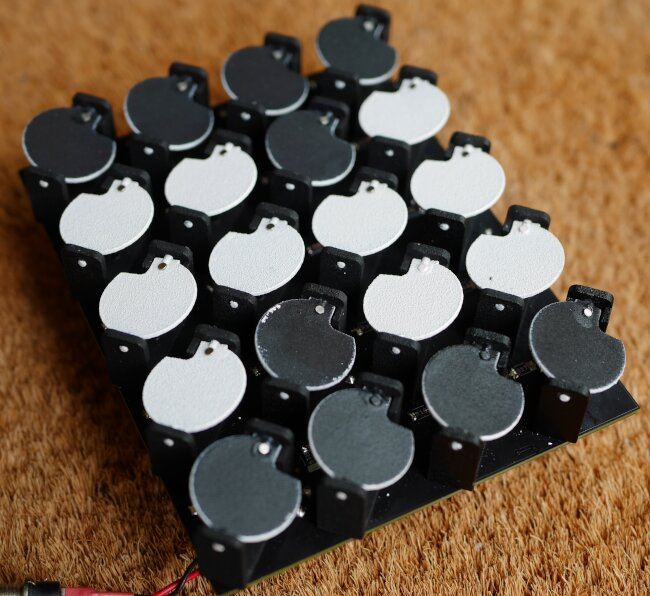
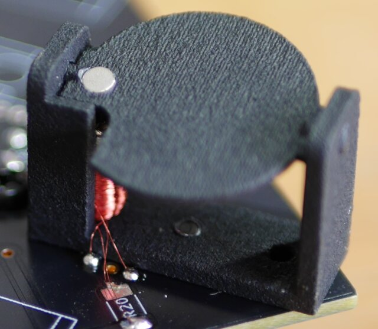
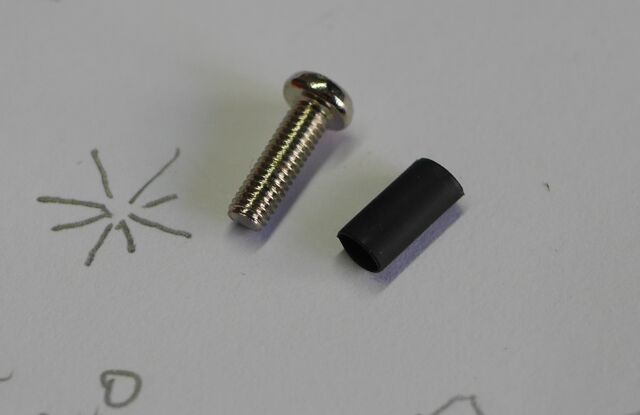
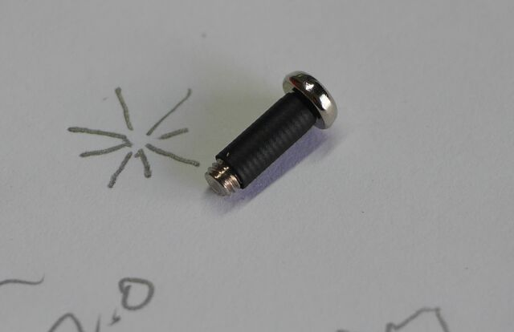
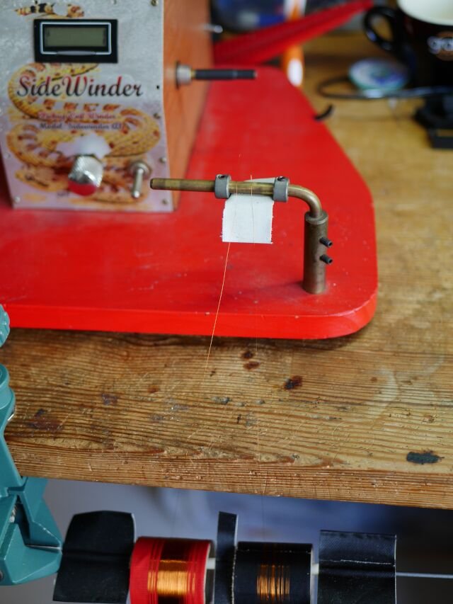
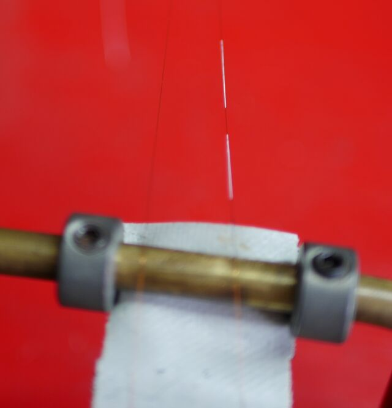
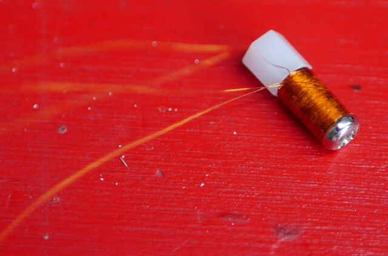

# flipdot

A DiY electromechanical "Flip-Dot" matrix 
display using 3D-printed components.

## Flipdot Assembly

The flipdot mechanism is 3D printed from a freecad model:

 - flipdot.FCStd : FreeCAD model
 - flipdot_body.stl : Mounting frame for flip-dot
 - flipdot_pixel.stl : Flip pixel

A small permanent magnet mounted in the pixel is rotated as required by
pulsing a centre-tapped solenoid wound over a steel screw.

## Solenoid Construction

Slip an 8mm length of heatshrink tube over an M3x10mm steel screw with
a head diameter between 5.0mm and 5.5mm. Make sure the screw is plain
steel and not stainless.

After shrinking, there should be between 1.5mm and 2.0mm of thread exposed.

Wipe a bead of PVA glue at either end of the screw to form a small
fillet.

Setup a winder with two spools of #43 polyurethane magnet wire.
Attach wires to a piece of tape on the guide and ensure a clean
feed of wire off each spool. This is the home position. Set speed
control to minimum and power on.

Using white correction fluid, mark a single 40mm length on the left wire.

Insert screw in winder spindle, finger tight.

Pull out start wires and wind them by hand a few turns over the
left hand side of the screw. Tape the excess lead wire to the spindle
leaving a small amount of slack where the wire attaches to the
screw.

Reset counter on the winder and set speed control to minimum.
Inspect spools and feed wires for tangles or twists.

Guiding the wire with one hand, increase the speed control on the winder
to a comfortable rate. Guide the wire back and forth across the length of
the screw to get an even wrapping, keeping an eye on the counter. As
the wind count passes 900, slow down the winder and guide the wire to
the right and then left side of the screw, stopping at about 1000 turns.

Place the feed wires across the coil, and use a drop of pva glue to
secure.

Gently wind back the feed spools to remove slack in the feed wires
clearly separating the left and right feeds. Attach wires to the home
position with a piece of tape, then mark the right feed wire with
two roughly 10mm lengths of white correction fluid.

Cut the feed wires near the home position, remove tape from spindle
and then carefully unscrew coil from spindle by holding the screw
assembly and turning the winder forward slowly by hand. Attach a 
plastic spacer until ready to install in a flipdot assembly.

## Flipdot Assembly

TBA

## 4x5 Modular Panel

Each pixel in a 4x5 array has a pair of low-side drivers connected
to 2 bits in a 40-bit shift register. Data is shifted into the display
and latched to energise the chosen coils:

 - flippnlr.pro : Kicad schematic and PCB

Panels are designed to be daisy-chained to build up a larger panel.

## Interface

A chain of display panels is driven using three signals:

 - D Data input (SDI)
 - DC Data clock (SCK)
 - RC Latch Clock 

The required data is shifted into the display using D and DC, then
latched to flipper coils by strobing RC. DC and RC have a minimum period
of 200ns as shown below:

D and DC can be driven by an SPI peripheral.

## Firmware

TBA

## License

CC0 Public Domain

To the extent possible under law, the author(s) have dedicated
all copyright and related and neighboring rights to this software
to the public domain worldwide. This software is distributed
without any warranty.

You should have received a copy of the CC0 Public Domain Dedication
along with this software. If not, see:

http://creativecommons.org/publicdomain/zero/1.0/

