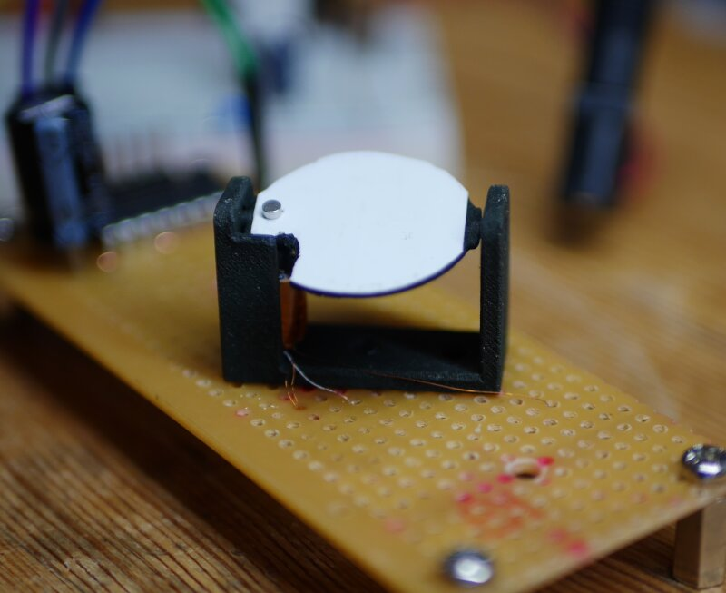

# flipdot

DiY Electromechanical Display

A DiY electromechanical "Flip-Dot" matrix 
display using 3D-printed components.

## Flipdot Assembly

The flipdot mechanism is 3D printed from a freecad model:

 - flipdot.FCStd : FreeCAD model
 - flipdot_body.stl : Mounting frame for flip-dot
 - flipdot_pixel.stl : Flip pixel

A small permanent magnet in the pixel is rotated as required by
pulsing a solenoid wound over a steel screw.

Wind about 500 turns of #42 guitar pickup wire as a pair onto
an M3x8mm screw, then join the end of one wire to the start of the
other. The join becomes a centre tap, which is connected to the positive
voltage rail. The desired set or clear movement is triggered by
shorting the desired coil to ground through a low-side switch
or darlington driver.

## 4x5 Modular Panel

Each pixel in a 4x5 array has a pair of low-side drivers connected
to 2 bits in a 40-bit shift register. Data is shifted into the display
and latched to energise the chosen coils:

 - flippnlr.pro : Kicad schematic and PCB

Panels are designed to be daisy-chained to build up a larger panel.

TBA

## License

CC0 Public Domain

To the extent possible under law, the author(s) have dedicated
all copyright and related and neighboring rights to this software
to the public domain worldwide. This software is distributed
without any warranty.

You should have received a copy of the CC0 Public Domain Dedication
along with this software. If not, see:

http://creativecommons.org/publicdomain/zero/1.0/

