# Flippnlr - 4x5 DiY Flipdot Panel

How _not_ to make a DiY electromechanical "Flip-Dot" matrix display.

## Coil Winding

M3 steel screw and heat shrink tube.

Shrink onto screw.

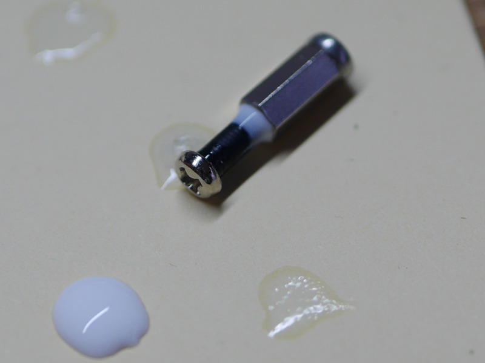

Add slight glue fillet.

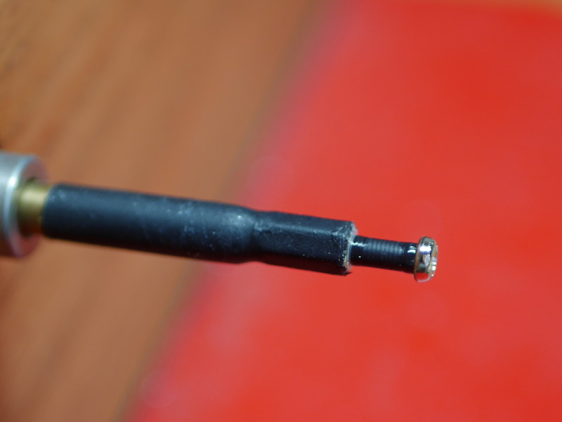

Mount in winder.

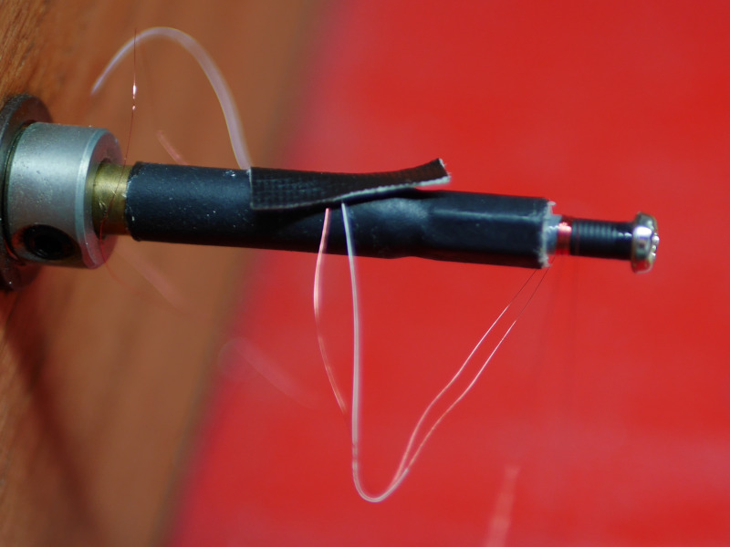

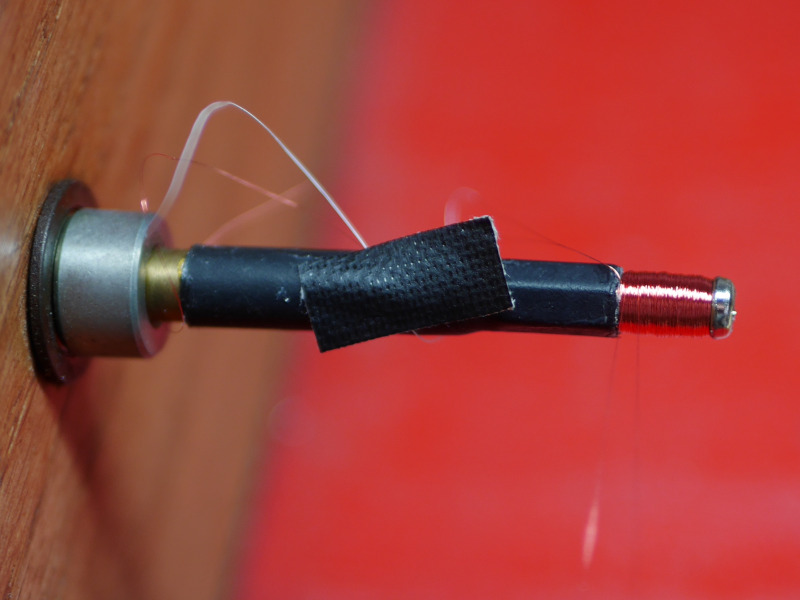

Wind about 1000 turns.

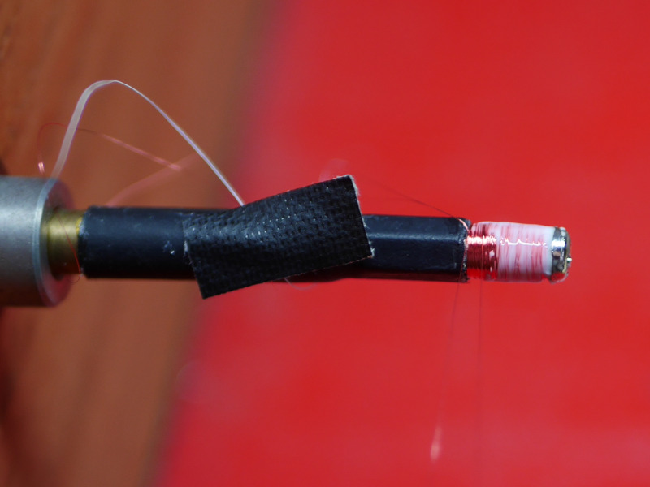

Finish with a thin layer of glue.

## Flipdot Mechanism

FreeCAD model: [flipdot.FCStd](flipdot.FCStd)

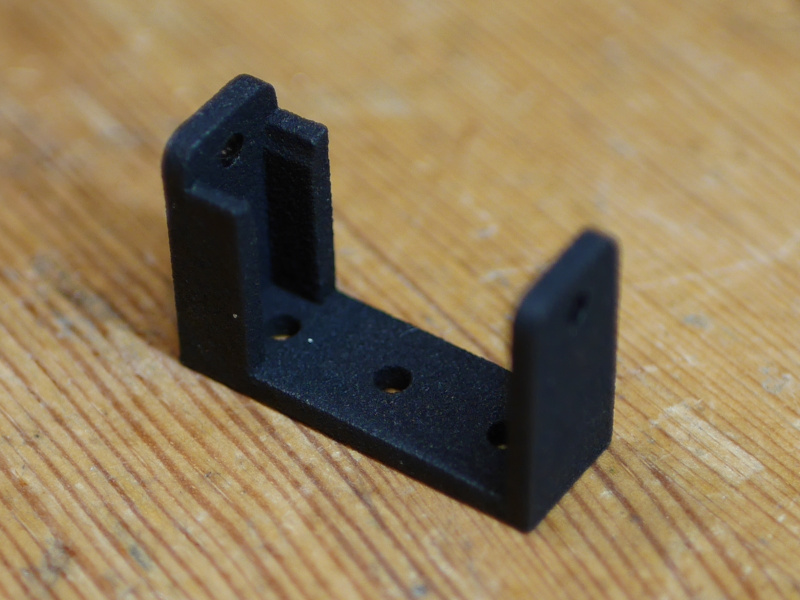

SLS printed housing.

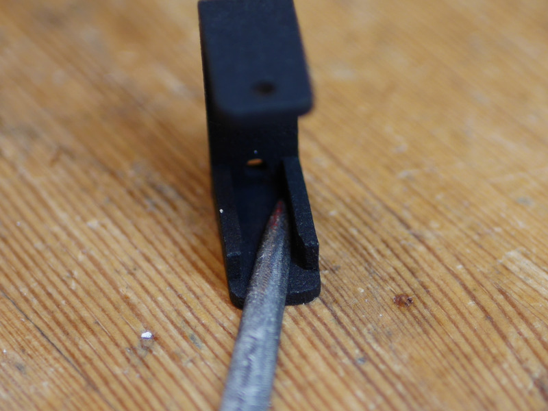

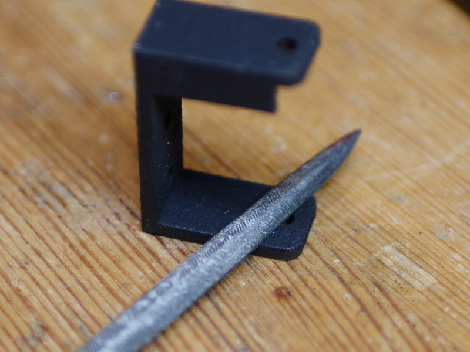

File contact areas.

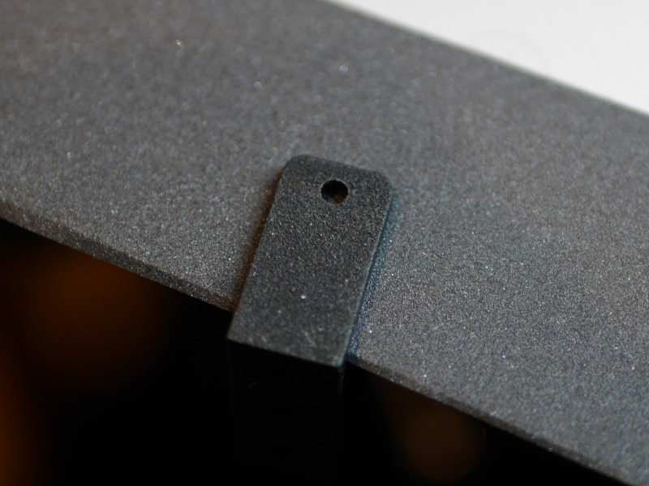

Smooth contact areas with fine sandpaper.

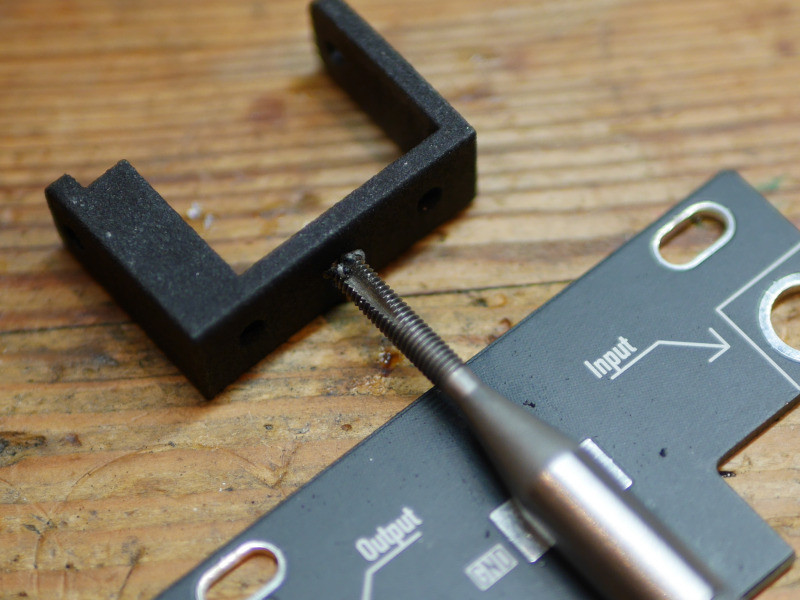

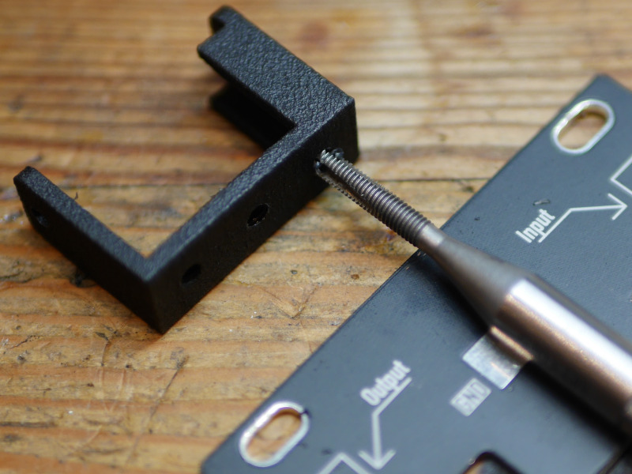

Tap mounting and coil holes with M3 thread.

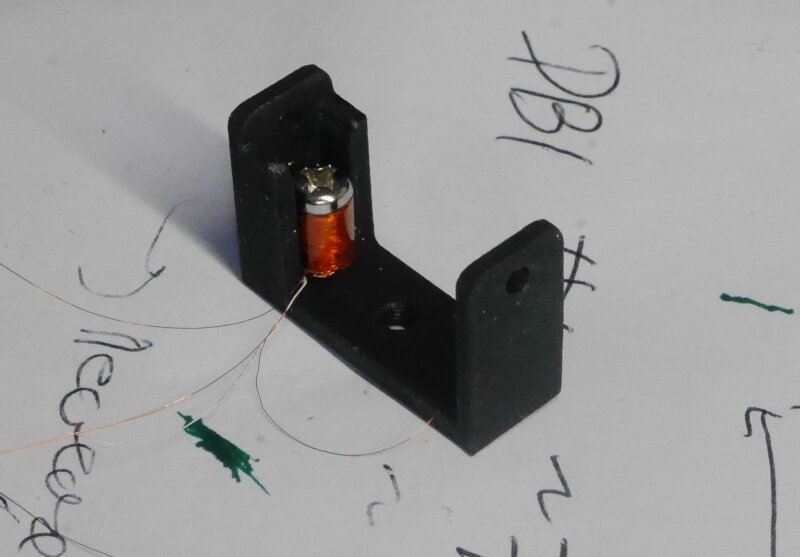

## Pixel Preparation

## Panel Assembly

Kicad PCB: [flippnlr.pro](flippnlr.pro)

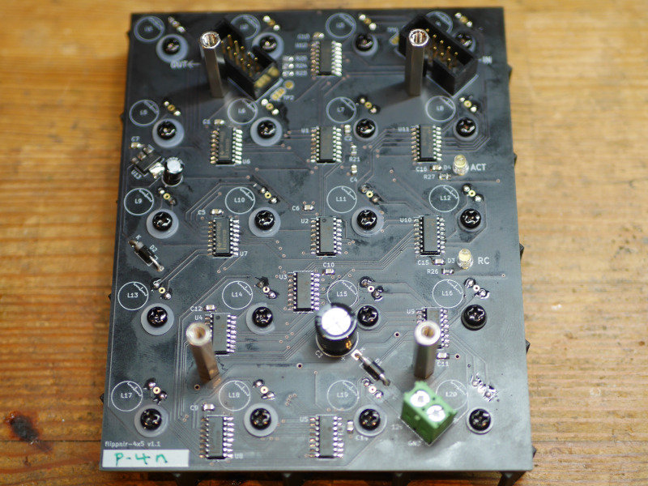

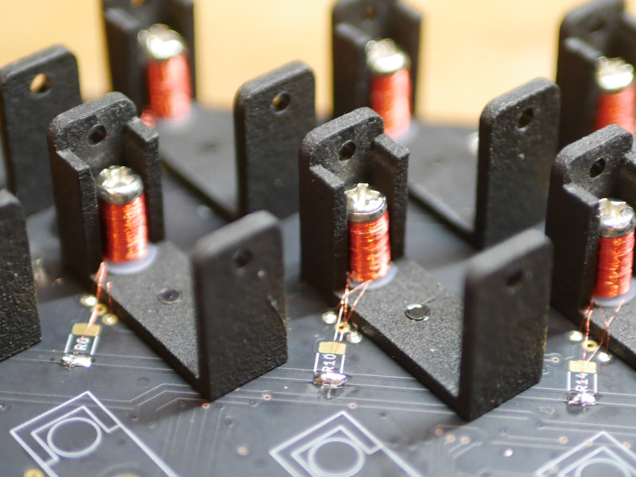

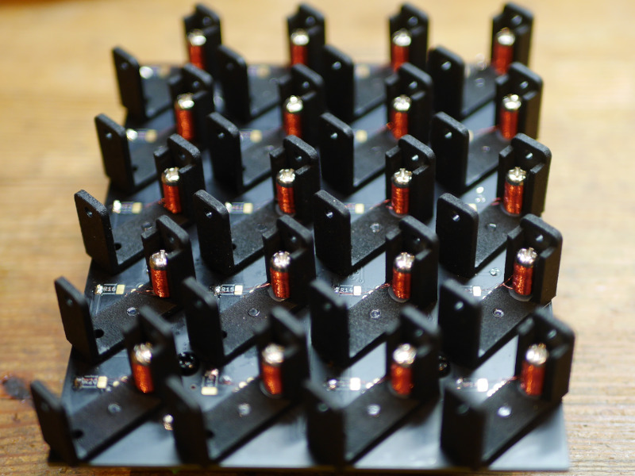

## Interface

 - D Data input (SDI)
 - DC Data clock (SCK)
 - RC Latch Clock 

## License

CC0 Public Domain

To the extent possible under law, the author(s) have dedicated
all copyright and related and neighboring rights to this software
to the public domain worldwide. This software is distributed
without any warranty.

You should have received a copy of the CC0 Public Domain Dedication
along with this software. If not, see:

http://creativecommons.org/publicdomain/zero/1.0/

